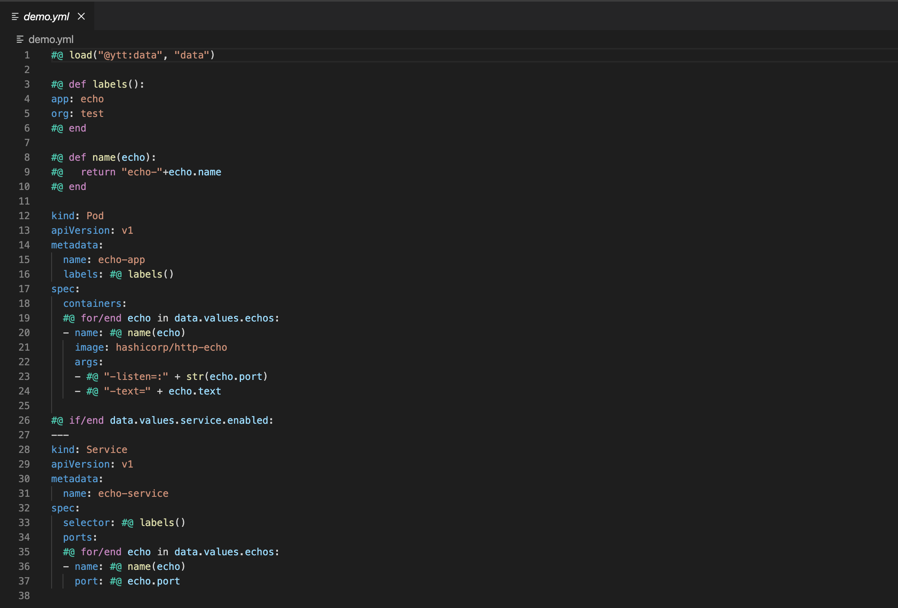

# ytt syntax highlighting for Visual Studio Code

Extension for syntax highlighting when editing yaml files for use with the [ytt
cli](https://github.com/k14s/ytt)

## Features

- Syntax highlighting

 

## Requirements

This extensions requires the [starlark language extension](https://github.com/phgn0/vscode-starlark)

## Known Issues

Theme overlap between starlark and yaml highlighting.
